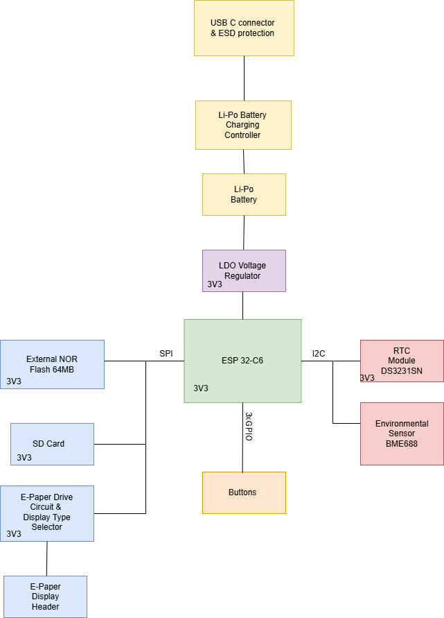

### OpenBook - Project

## Block Diagram

---
## Bill Of Materials (BOM)
| Component                   | Source                                                                                                                                                                      | Datasheet                                               |
|-----------------------------|-----------------------------------------------------------------------------------------------------------------------------------------------------------------------------|---------------------------------------------------------|
| Button                      | [Mouser](https://ro.mouser.com/ProductDetail/CK/KMR221GULCLFS?qs=u2NJ%252B70r0goBXaNk7IrU0Q%3D%3D)                                                                          |[Datasheet](https://www.ckswitches.com/media/1479/kmr2.pdf)|
| Capacitor SUPERCAP          | [Mouser](https://ro.mouser.com/ProductDetail/Seiko-Semiconductors/CPH3225A?qs=3etwrb1wR%252BhUOph6lAO7eg%3D%3D)                                                             | [Datasheet](https://ro.mouser.com/datasheet/2/360/Seiko_Instruments_MicroBattery_E_20230330_2024Jan_-3561061.pdf)|
| Capacitor 100nF             | [Mouser](https://ro.mouser.com/ProductDetail/KEMET/C0402C104K4RAL?qs=pIZUS6sqCWCaMuP2QVR%2Fog%3D%3D)                                                                        | [Datasheet](https://ro.mouser.com/datasheet/2/447/KEM_C1018_X7R_SnPb_SMD-3316276.pdf)|
| Capacitor 4.7uF             | [Mouser](https://ro.mouser.com/ProductDetail/KEMET/C0402C475M9PAC7411?qs=cpo3%2FpBou2jRzZxyxJnMGg%3D%3D)                                                                    | [Datasheet](https://ro.mouser.com/datasheet/2/447/KEM_C1006_X5R_SMD-3316465.pdf)|
| Capacitor 100uF TANT        | [Mouser](https://ro.mouser.com/ProductDetail/KYOCERA-AVX/TAJW107M010RNJ?qs=Wtp%252Bf%2FAeVqIH8v1VxV%252B1Rg%3D%3D)                                                          | [Datasheet](https://ro.mouser.com/datasheet/2/40/TAJ-3165264.pdf)|
| Capacitor 4.7uF / 25V       | [Mouser](https://ro.mouser.com/ProductDetail/KYOCERA-AVX/12063C475KAZ2A?qs=%252BdQmOuGyFcG3LdbVp5waMw%3D%3D)                                                                | [Datasheet](https://ro.mouser.com/datasheet/2/40/X7RDielectric-2943470.pdf)|
| Capacitor 1uF               | [Mouser](https://ro.mouser.com/ProductDetail/KEMET/C0402C105K9PACTU?qs=UdQET6xYxVCMExqTDkuPeQ%3D%3D)                                                                        | [Datasheet](https://ro.mouser.com/datasheet/2/447/KEM_C1006_X5R_SMD-3316465.pdf)|
| Capacitor 10uF              | [Mouser](https://ro.mouser.com/ProductDetail/KEMET/C0402C106M9PACTU?qs=x4XeXhDQKnp%252Bz0lMlwMC3A%3D%3D)                                                                    | [Datasheet](https://ro.mouser.com/datasheet/2/447/KEM_C1006_X5R_SMD-3316465.pdf)|
| CHG_LED                     | [CPC](https://cpc.farnell.com/kingbright/kpg-1608zgc/led-smd-0603-grn/dp/SC20796)                                                                                           | [Datasheet](https://www.farnell.com/datasheets/2046349.pdf)|
| USBLC6-2SC6Y                | [Mouser](https://ro.mouser.com/ProductDetail/STMicroelectronics/USBLC6-2SC6Y?qs=gNDSiZmRJS%2FOgDexvXkdow%3D%3D)                                                             | [Datasheet](https://ro.mouser.com/datasheet/2/389/usblc6_2sc6y-1852505.pdf)|
| PGB1010603MR                | [Mouser](https://ro.mouser.com/ProductDetail/Littelfuse/PGB1010603MR?qs=gu7KAQ731URLg4GSnNNN7Q%3D%3D)                                                                       | [Datasheet](https://www.littelfuse.com/assetdocs/pulseguard-esd-suppressors-pgb1-datasheet?assetguid=8a337998-d54d-466b-be4e-dc5bcd1f9321)|
| SD0805S020S1R0              | [Mouser](https://ro.mouser.com/ProductDetail/KYOCERA-AVX/SD0805S020S1R0?qs=jCA%252BPfw4LHbpkAoSnwrdjw%3D%3D)                                                                | [Datasheet](https://ro.mouser.com/datasheet/2/40/schottky-3165252.pdf)|
| MBR0530                     | [Mouser](https://ro.mouser.com/ProductDetail/onsemi/MBR0530T3G?qs=3JMERSakebpEmdUS6GetdQ%3D%3D)                                                                             | [Datasheet](https://www.onsemi.com/products/discrete-power-modules/schottky-diodes-schottky-rectifiers/mbr0530t3g)|
| Solder Jumper               | [Grabcad](https://grabcad.com/library/solder-jumpers-1)                                                                                                                     | [Datasheet](https://grabcad.com/library/solder-jumpers-1)|
| Capacitor 1uF / 50V         | [Mouser](https://ro.mouser.com/ProductDetail/TDK/C1608X7R1H105K080AB?qs=sGAEpiMZZMsh%252B1woXyUXjwVqLNpRsvnQGmKhuYn4DWE%3D)                                                 | [Datasheet](https://product.tdk.com/system/files/dam/doc/product/capacitor/ceramic/mlcc/catalog/mlcc_commercial_general_en.pdf)|
| Capacitor 0.1uF / 50V       | [Farnell](https://ro.farnell.com/multicomp-pro/mcmlr50v104kx7r/ceramic-capacitor-0-1uf-50v-x7r/dp/1600875?srsltid=AfmBOop-NuqSwaWYAsNDvdMnjraBeqfj0sl8f99iLZ_KJc8xpnT4fSqT) | [Datasheet](https://www.farnell.com/datasheets/2873577.pdf?_gl=1*x28a2*_gcl_au*MTYwODAzNzc2OC4xNzQzNDM1MjM4)|
| BD5229G-TR                  | [Mouser](https://ro.mouser.com/ProductDetail/ROHM-Semiconductor/BD5229G-TR?qs=4kLU8WoGk0vvnhrrYwdszw%3D%3D)                                                                 | [Datasheet](https://fscdn.rohm.com/en/products/databook/datasheet/ic/power/voltage_detector/bd52xxg-e.pdf)|
| XC6220A331MR-G              | [Mouser](https://ro.mouser.com/ProductDetail/Torex-Semiconductor/XC6220A331MR-G?qs=AsjdqWjXhJ8ZSWznL1J0gg%3D%3D)                                                            | [Datasheet](https://ro.mouser.com/datasheet/2/760/xc6220-3371556.pdf)|
| FH34SRJ-24S-0.5SH_99_       | [Mouser](https://ro.mouser.com/ProductDetail/Hirose-Connector/FH34SRJ-24S-0.5SH99?qs=vcbW%252B4%252BSTIpKBl5ap9J8Fw%3D%3D)                                                  | [Datasheet](https://ro.mouser.com/datasheet/2/185/FH34SRJ_24S_0_5SH_99__CL0580_1255_6_99_2DDrawing_0-1615044.pdf)|
| SAMACSYS_PARTS_USB4110-GF-A | [Mouser](https://ro.mouser.com/ProductDetail/GCT/USB4110-GF-A?qs=KUoIvG%2F9IlYiZvIXQjyJeA%3D%3D)                                                                            | [Datasheet](https://ro.mouser.com/datasheet/2/837/GCT_USB4110_Product_Drawing___20k_cycles-3455479.pdf)|
| QWIIC_RIGHT_ANGLEA          | [Mouser](https://ro.mouser.com/ProductDetail/JST-Commercial/SM04B-SRSS-TBLFSN?qs=cdbOS8ANM9B3FdyA6cNU2A%3D%3D)                                                              | [Datasheet](https://ro.mouser.com/datasheet/2/564/eSR_SZ-3476820.pdf)|
| 112A-TAAR-R03_ATTEND        | [LCSC](https://www.lcsc.com/product-detail/SD-Card-Connectors_Attend-Technology-112A-TAAR-R03_C6970445.html)                                                                | [Datasheet](https://www.lcsc.com/datasheet/lcsc_datasheet_2411220717_Attend-Technology-112A-TAAR-R03_C6970445.pdf)|
| Bobina                      | [Mouser](https://ro.mouser.com/ProductDetail/Wurth-Elektronik/744043680?qs=PGXP4M47uW6VkZq%252BkzjrHA%3D%3D)                                                                | [Datasheet](https://www.we-online.com/components/products/datasheet/744043680.pdf)|
| MCP73831                    | [Mouser](https://ro.mouser.com/ProductDetail/Microchip-Technology/MCP73831-2ACI-MC?qs=hH%252BOa0VZEiBneYTVdpuVdg%3D%3D)                                                     | [Datasheet](https://ro.mouser.com/datasheet/2/268/MCP73831_Family_Data_Sheet_DS20001984H-3441711.pdf)|
| PFMF.050.1                  | [Mouser](https://ro.mouser.com/ProductDetail/Schurter/PFMF.050.2?qs=1auRipcfynCums5v1iucSA%3D%3D)                                                                           | [Datasheet](https://ro.mouser.com/datasheet/2/358/typ_PFMF-1275918.pdf)|
| DMG2305UX-7                 | [Mouser](https://ro.mouser.com/ProductDetail/Diodes-Incorporated/DMG2305UX-7?qs=L1DZKBg7t5F%2FNBHrjfxC%252Bg%3D%3D)                                                         | [Datasheet](https://www.diodes.com/assets/Datasheets/DMG2305UX.pdf)|
| SI1308EDL-T1-GE3            | [Mouser](https://ro.mouser.com/ProductDetail/Vishay-Semiconductors/SI1308EDL-T1-GE3?qs=bX1%252BNvsK%2FBramh9tgpOaEw%3D%3D)                                                  | [Datasheet](https://www.vishay.com/docs/63399/si1308edl.pdf)|
| Resistor 10K                | [DigiKey](https://www.digikey.com/en/products/detail/venkel/CR0402-10W-102JT/12332774)                                                                                      | [Datasheet](https://data.venkel.com/documents/cr-series?_gl=1*mn27ew*_ga*MTAzMTIxOTYyMS4xNzQzNzU5MjAy*_ga_JRKGBZNVM8*MTc0Mzc1OTIwMS4xLjAuMTc0Mzc1OTIwMi41OS4wLjA.)|
| Resistor 100K               | [Venkel](https://venkel.com/part/CR0402-16W-1003FT)                                                                                                                         | [Datasheet](https://data.venkel.com/documents/cr-series?_gl=1*oleae1*_ga*MTAzMTIxOTYyMS4xNzQzNzU5MjAy*_ga_JRKGBZNVM8*MTc0Mzc1OTIwMS4xLjEuMTc0Mzc1OTM0My4zNi4wLjA.)|
| Resistor 5k1                | [Venkel](https://venkel.com/part/CR0402-10W-5101FT)                                                                                                                         | [Datasheet](https://data.venkel.com/documents/cr-series?_gl=1*1e041jc*_ga*MTAzMTIxOTYyMS4xNzQzNzU5MjAy*_ga_JRKGBZNVM8*MTc0Mzc1OTIwMS4xLjEuMTc0Mzc1OTU2Ny41MS4wLjA.)|
| Resistor 2k                 | [Venkel](https://www.venkel.com/part/CR0402-16W-2002FT)                                                                                                                     | [Datasheet](https://data.venkel.com/documents/cr-series?_gl=1*1sqolfs*_ga*MTAzMTIxOTYyMS4xNzQzNzU5MjAy*_ga_JRKGBZNVM8*MTc0Mzc1OTIwMS4xLjEuMTc0Mzc1OTY2OS4zNC4wLjA.)|
| Resistor 0.47               | [Mouser](https://ro.mouser.com/ProductDetail/Vishay-Beyschlag/MCT06030C4700FP500?qs=XsZ9OvPb0dt82KlzjdcMjQ%3D%3D)                                                           | [Datasheet](https://www.vishay.com/docs/28705/mcx0x0xpro.pdf)|
| BME688                      | [Mouser](https://ro.mouser.com/ProductDetail/Bosch-Sensortec/BME688?qs=IS%252B4QmGtzzqQoVDscqwx3A%3D%3D)                                                                    | [Datasheet](https://ro.mouser.com/datasheet/2/783/bst_bme688_fl000-2307034.pdf)|
| W25Q512JVEIQ                | [Mouser](https://ro.mouser.com/ProductDetail/Winbond/W25Q512JVEIQ?qs=l7cgNqFNU1jw6svr3at6tA%3D%3D)                                                                          | [Datasheet](https://ro.mouser.com/datasheet/2/949/Winbond_W25Q512JV_Datasheet-3240039.pdf)|
| ESP32-C6-WROOM-1-N8         | [Mouser](https://ro.mouser.com/ProductDetail/Espressif-Systems/ESP32-C6-WROOM-1-N8?qs=8Wlm6%252BaMh8ST02Gmwp74cw%3D%3D)                                                     | [Datasheet](https://ro.mouser.com/datasheet/2/891/Espressif_ESP32_C6_WROOM_1__Datasheet_V0_1_PRELIMI-3239987.pdf)|
| DS3231SN#                   | [Mouser](https://ro.mouser.com/ProductDetail/Analog-Devices-Maxim-Integrated/DS3231SN?qs=1eQvB6Dk1vhUlr8%2FOrV0Fw%3D%3D)                                                    | [Datasheet](https://ro.mouser.com/datasheet/2/609/DS3231-3421123.pdf)|
| MAX17048G+T10               | [Mouser](https://ro.mouser.com/ProductDetail/Analog-Devices-Maxim-Integrated/MAX17048G%2bT10?qs=D7PJwyCwLAoGnnn8jEPRBQ%3D%3D)                                               | [Datasheet](https://ro.mouser.com/datasheet/2/609/MAX17048_MAX17049-3469099.pdf)|
| Test Pad                    | [DigiKey](https://www.digikey.com/en/products/detail/keystone-electronics/5006/255330)                                                                                      | [Datasheet](https://www.keyelco.com/userAssets/file/M65p56.pdf)|

---

# Hardware Functionality

**Power Supply & Energy Management:**
- **USB with ESD:** Provides power and protects data lines.
- **Li-Po Charging Circuit - MCP73831:** Controlled charging for the 1800 mAh battery.
- **Li-Po Battery & LDO Voltage Regulator:** Regulates voltage to 3.3V for all modules.

**Microcontroller & Interfaces:**
- **ESP32-C6:**
    - **SPI:** Connects NOR Flash memory, SD card, and e-paper display.
    - **I2C:** Connects RTC DS3231, BME688 sensor, and expansion modules.
    - **UART:** For debugging and serial communication.
    - **GPIO:** For buttons and test pads.

**Storage & Display Modules:**
- **NOR Flash Memory (SPI)** Fast storage for firmware and data.
- **SD Card (SPI)** Expands storage capacity.
- **E-Paper Display:** Low-power, precise updates, controlled via SPI.

**Additional Modules & Sensors:**
- **RTC DS3231 (I2C):** Real-time clock.
- **BME688 Sensor (I2C):** Measures temperature, humidity, pressure, and air quality.
- **Qwiic/Stemma QT Connector (I2C):** Allows expansion with additional modules.
- **Test Pads & Buttons (GPIO):** Facilitate direct control and diagnostics.

**Power Optimization:**
- **ESP32-C6 Low-Power Mode:** Reduces consumption through dynamic frequency and activity management.
- **Stable LDO:** Ensures a constant 3.3V voltage.
- **SMD Components (e.g., 0402 capacitors):** Minimize consumption through small size and improved efficiency.

---

# ESP32-C6 Pin Mapping

| Nume | GPIO        | Usage                                          | Notes                                                                                                                           |
|------|-------------|------------------------------------------------|---------------------------------------------------------------------------------------------------------------------------------|
| 3V3  | 3V3         | 3.3V Power Supply                               | Voltage source for ESP32-C6 and logic components.                                                                       |
| SCK (SPI) | IO6         | SPI Clock                               | Provides the clock signal for high-speed data transfers.                                                                           |
| MOSI (SPI) | IO7         | SPI Data Transmission                           | Sends data to NOR Flash, SD Card, and E-Paper.                                                                               |
| MISO (SPI) | IO2         | SPI Data Reception                            | Receives data from SPI devices.                                                                                          |
| FLASH_CS | IO11        | SPI Chip Select for NOR Flash                | Selects the NOR Flash memory on the SPI bus.                                                                                 |
| EPD_CS | IO10        | SPI Chip Select for E-Paper                   | Selects the e-paper display.                                                                                                    |
| SDA (I2C) | IO21        | I2C Data Line                              | Connects RTC DS3231, BME688 sensor, and Qwiic/Stemma QT connector.                                                           |
| SCL (I2C) | IO22        | I2C Clock Line                              | Synchronizes I2C communication.                                                                                                 |
| TX (UART) | TXD0/GPIO16 | UART Data Transmission                          | Used for debugging and serial communication.                                                                                   |
| RX (UART) | RXD0/GPIO17 | UART Data Reception                             | Used for debugging and serial communication.                                                                                   |
| Buton Reset | EN          | ESP32-C6 Reset                              | Pin dedicat pentru resetul sistemului.                                                                                          |
| Buton Boot | IO9         | Bootloader Entry                          | Dedicated pin to enter boot mode.                                                                                       |
| Buton Change | IO15        | Operation Mode Switch                          | Allows switching between different operating modes.                                                                               |
| EPD DC | IO5         | Data/Command for E-Paper                   | Distinguishes between command and data signals for the display.                                                                |
| EPD RST | IO23        | E-Paper Reset                               | Resets the e-paper display when needed.                                                                                   |
| EPD BUSY | IO3         | E-Paper Busy Indicator                        | Signal indicating if the display is currently busy.                                                                                   |
| INT_RTC | IO0         | RTC Interrupt Signal (DS3231)        | Triggers the microcontroller.                                                                                                     |
| 32KHZ | IO1         | 32 kHz Clock Signal                | Oscillation line for DS3231 or other modules (not directly connected to ESP).                                                        |
| SS_SD| IO4         | SPI Chip Select for SD Card               | Selects the SD card on the SPI bus.                                                                                        |
| USB_D- | IO12        | USB Differential Line (minus)                  | Connection to the USB port.                                                                                                        |
| USB_D+ | IO13        | USB Differential Line (plus)                   | Connection to the USB port.                                                                                                        |
| RTC_RST | IO18        | External RTC Reset/Signal                         | Used to reset the real-time clock.                                                                                    |
| I2C_PW | IO19        | I2C Power/Enable Line         | Turns I2C sensors on/off to save energy.                                                |
| EPD_3V3_C | IO20        | 3.3V Power Line for E-Paper         | Provides 3.3V specifically for the e-paper display, separate from main power, to ensure signal stability. |

---
## Motivation

- **SPI** (SCK, MOSI, MISO, CS lines) provides fast transfer for external memory (Flash), SD card, and e-paper display.
- **I2C** (SDA, SCL) connects sensors (RTC, BME688) and the Qwiic connector, allowing bus sharing with low power consumption.
- **UART** (TX, RX) is used for debugging.
- **Additional GPIOs** (buttons, test pads) facilitate manual control and diagnostics.

---

## Implementation Steps

- **Schematic:** Created the schematic according to the project requirements.
- **PCB Redesign:** Redesigned the PCB and placed components on the board based on the reference model.
- **Autorouting:** Performed autorouting on both top and bottom layers, using a 0.15 mm trace width for signal lines.
- **Power Net Class:** Grouped power traces into a net class, highlighted them, and manually adjusted to 0.3 mm to ensure robust power delivery.
- **Ground Planes and Via Stitching:** Added ground planes on top and bottom layers and applied via stitching near the ESP module for optimal inter-layer connectivity.
- **3D Models:** Downloaded component 3D models from [ComponentSearchEngine](https://componentsearchengine.com/), imported them into Fusion 360, and placed them on the PCB.
- **Enclosure Integration:** Inserted the PCB into the enclosure and modified it to properly fit the buttons and connectors.
- **3D Models for Battery and Display:** Created 3D models for the battery and display, connecting wires to the corresponding test pads and ensuring correct placement inside the enclosure.
- **Export:** Finally, generated Gerber files, Pick and Place (CPL), and BOM, preparing them for upload and production.

---

## Issues Encountered and Error Acceptance Decisions

- **3D Model for Button:**  
  Could not find a 3D model for the button that perfectly matched the project requirements, so I modified an existing model to fit the design.

- **SMD-Hole Board Outline Clearance Errors at USB Connector:**  
  Encountered two SMD-Hole Board Outline Clearance errors at the USB connector. These errors were accepted according to the provided guidelines.
---

## Conclusion
 I resolved the reported issues by adjusting the PCB thickness and adding 3D models for the solder jumper and test pads.
 For the test pads, I implemented a custom model.

